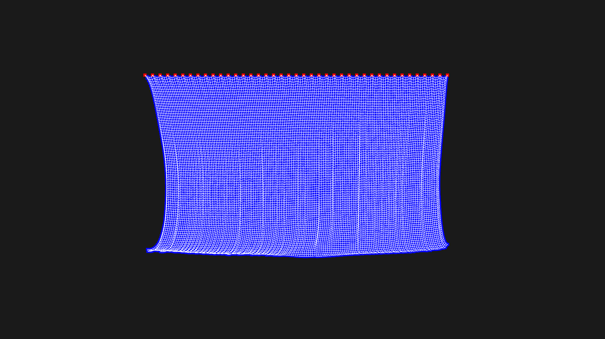
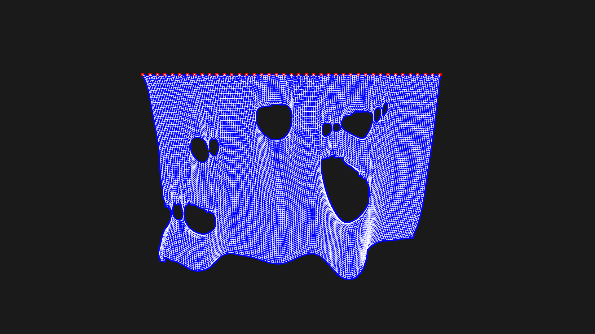

# Cloth-simulation

A cloth simulation using Verlet integration and Bevy game engine.

Cutting the cloth (deleting points) causes a lot of warnings from the bevy ecs, probably I'm not using the best method for despawning entities.
